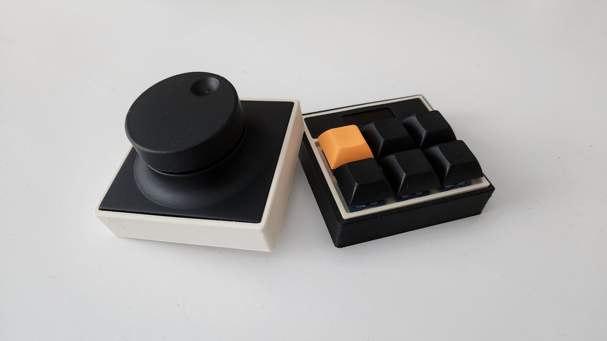
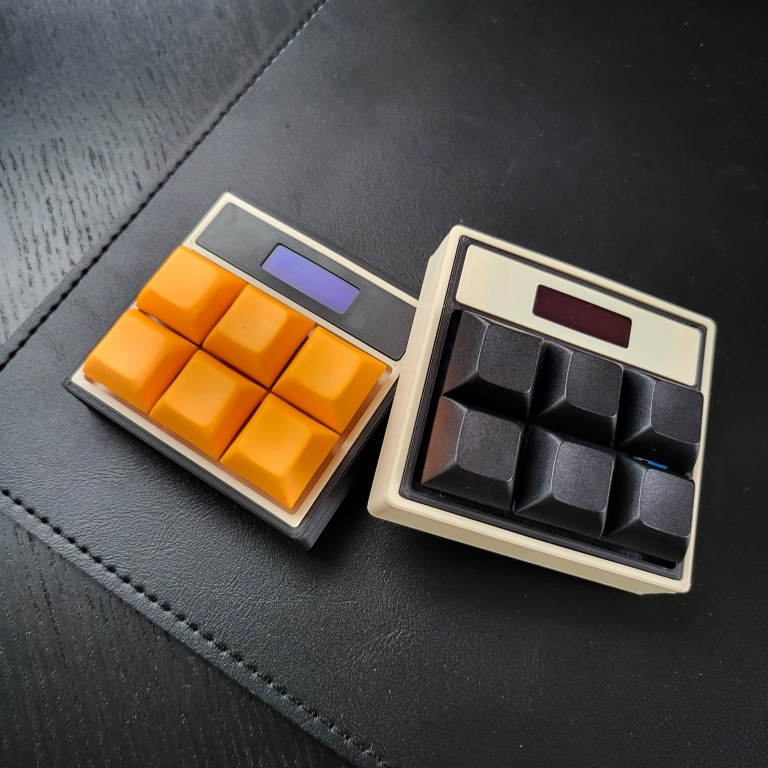
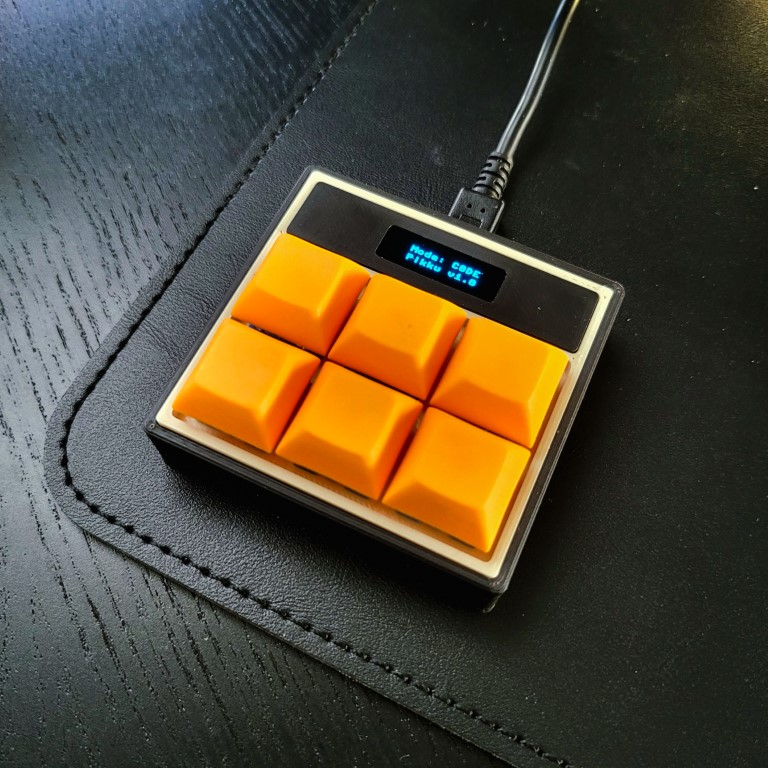
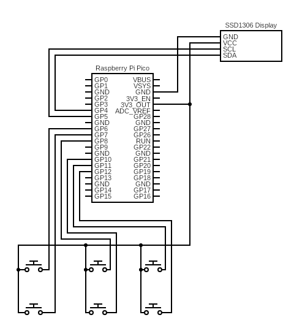
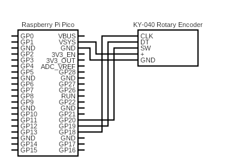
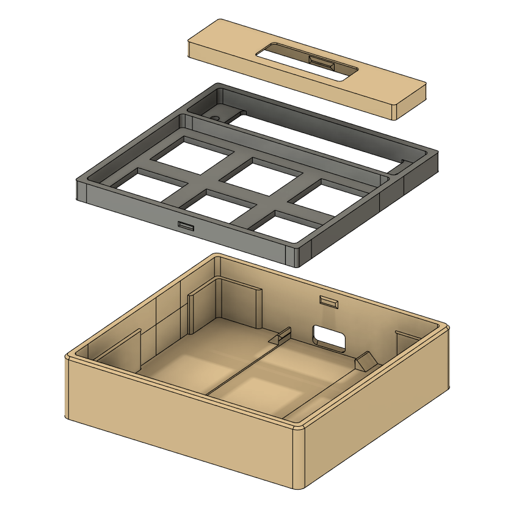
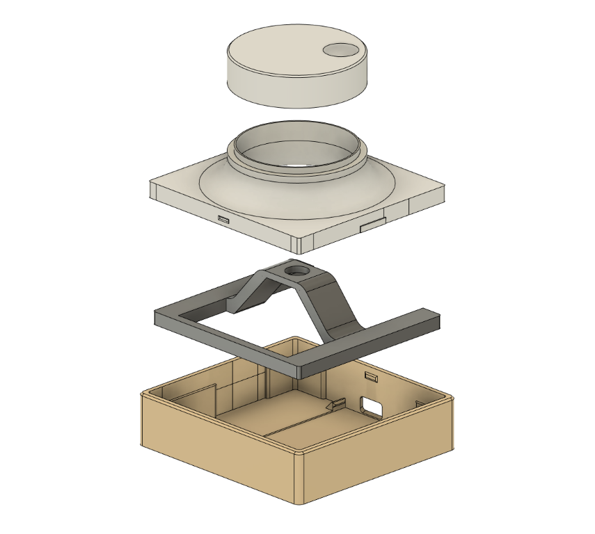

# Pikku - Raspberry Pi Pico Powered Macropad and Dial

This is a simple macropad built with Raspberry Pi Pico. See detailed description in my blog post at:

[www.codeof.me/pikku-raspberry-pi-pico-powered-macropad](https://www.codeof.me/pikku-raspberry-pi-pico-powered-macropad)

**New!** Wrote a short entry also for the Dial Controller:

[www.codeof.me/pikku-dial-multi-mode-dial-controller](https://www.codeof.me/pikku-dial-multi-mode-dial-controller)

Macropad support different models which you can change by pressing the top left key. Other buttons can be customized to do different things. This initial code includes the following modes:

| Mode | Action | Key |
|---|---|---|
| **Microsoft Teams** | | |
| | Search | Key 2 |
| | Goto |       Key 3 |
| | Toggle mute | Key 4 |
| | Toggle camera | Key 5 |
| | Hangup | Key 6 |
| **VS Code** | | |
| | Explorer | Key 2 |
| | Problems | Key 3 |
| | Search | Key 4 |
| | Debug | Key 5 |
| | Output | Key 6 |
| **Git** | | |
| | Branch.. | Key 2 |
| | Checkout main | Key 3 |
| | Status | Key 4 |
| | Push | Key 5 |
| | Pull org main | Key 6 |

The active mode is displayed in a small SSD1306 display.

## Dial

Dial has simpler code. It'll use the KY-040 rotary encoder's switch function to switch between different modes. The current code includes four modes:

- Volume up/down
- Scroll up/down (as mouse wheel)
- Arrow keys up/down
- Fidget mode (doesn't do anything. Stress toy 😀)

# Schematics

## Macropad

## Dial

# 3D Printed Case

## Macropad

Case is constructed of three parts. All parts can be printed without support. Parts snap-fit together without need for glue. STL files can be found from the [stl-files](stl-files/) folder.

## Dial

Dial uses the same base part but add different panels on top of that.

